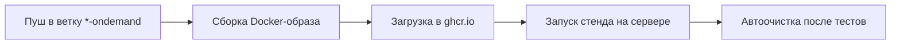

# On-Demand Deployment System
## 🚀 Система для автоматической сборки и развертывания приложений в режиме ondemand

Этот проект позволяет быстро разворачивать тестовые стенды приложения по требованию. Каждый стенд:
- Создается автоматически при пуше в ветку с суффиксом -ondemand (например, test-ondemand).
- Использует изолированные Docker-образы, собранные из указанной ветки backend-репозитория.
- Автоматически удаляется после завершения тестирования (короткоживущие стенды).

### 🔧 Как это работает
1. Конфигурация
Параметры сборки задаются в файле ondemand.config:

```ini
BACK_BRANCH=main  # Ветка backend-репозитория для сборки образа
```

2. Триггер сборки

При пуше в ветку *-ondemand (например, feature-auth-ondemand) GitHub Actions автоматически:
- Собирает Docker-образ с тегом back-<env> (например, back-feature-auth).
- Пушит образ в GitHub Container Registry (ghcr.io).

3. Развертывание стенда

Образы используются для запуска временных стендов на сервере (например, через Docker или Kubernetes).

### 🛠️ Использование
1. Создание ondemand-стенда

```bash
git checkout -b mytest-ondemand  # Ветка ДОЛЖНА оканчиваться на "-ondemand"
git push origin mytest-ondemand
```

2. Просмотр собранных образов

Образы доступны в [Packages репозитория](https://github.com/hse-perm-ondemand/ondemand/pkgs/container/ondemand)

3. Процесс сборки и запуска стенда:

